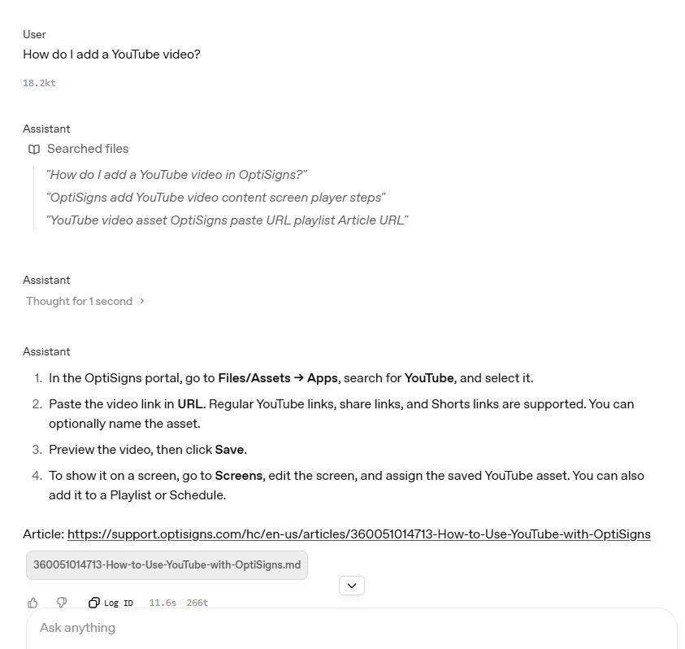

# kb-sync: help center → Markdown → OpenAI vector store

Pulls every published article from the OptiSigns Zendesk Help Center, converts it to clean Markdown, and keeps an OpenAI vector store in sync for the **OptiBot** support assistant. It runs once a day and uploads only what changed.

```
Zendesk Help Center API ─► cleaner (HTML→MD) ─► diff vs. store attributes ─► upload delta ─► log + last_run.json
```

## Setup
```bash
cp .env.sample .env            # add your API_KEY (OpenAI)
pip install -r requirements.txt
```

## Run locally
```bash
python main.py --scrape-only   # writes articles/<id>-<slug>.md only
python main.py                 # full sync (creates/finds the "optibot-kb" vector store)
python ask.py "How do I add a YouTube video?"   # answer + cited files, from the terminal
python -m pytest -q            # 22 tests, no network needed

docker build -t kb-sync .
docker run --rm -e API_KEY=sk-... kb-sync main.py   # one run, exits 0
```
A second run prints `RESULT added=0 updated=0 skipped=N`. Each run also writes `artifacts/last_run.json`.

## How it works
- **Scrape.** Uses the public Help Center API (`/api/v2/help_center/en-us/articles.json`) with pagination and retry/back-off on 429/5xx. Drafts are skipped. The API returns only the article body, so there is no nav, header or footer to strip.
- **Clean.** Uses BeautifulSoup and markdownify:
  - Removes scripts, styles, widgets and ad/promo blocks, and unwraps styling `<span>`s.
  - Converts headings to ATX style and turns `<pre>` into fenced code blocks with their language.
  - Keeps relative links verbatim. In-page anchors are re-emitted as `<a id>`, so the article's TOC links still resolve.
  - Turns Zendesk 1-column "IMPORTANT/NOTE" tables into blockquotes and keeps real tables as tables.
  - Turns YouTube iframes into links.
  - Each file starts with `# Title` and `Article URL: …`, and the URL is repeated at the end, so the assistant can always cite.
- **Delta.** Every file in the vector store carries `attributes = {article_id, content_hash (sha256 of the Markdown), url, …}`. Each run lists the store and classifies articles as **added**, **updated** (hash changed, ingest failed, or a duplicate exists) or **skipped**. Updates upload the new file first and delete the old one afterwards. The job keeps no state of its own and needs no database or volume.
- **Chunking.** One file per article, so each chunk belongs to exactly one citable URL. The store uses OpenAI `static` chunking with **1,200 tokens and 200 overlap**:
  - Most help articles fit in one or two chunks.
  - The header and footer URL lines mean the first and last chunk always contain the source.
  - The overlap keeps step lists from being cut mid-procedure.
  - The API doesn't report chunk counts, so they are computed locally with `tiktoken` using the same window and logged.

## Daily job
The job is deployed on **DigitalOcean App Platform** as a scheduled job (`.do/app.yaml`, cron `0 2 * * *` UTC). Set `API_KEY` as an encrypted env var.
DigitalOcean only shows job logs to account members. To give the logs a public URL, every run publishes its own log to a GitHub Gist (`LOG_GIST_ID`, `LOG_GIST_TOKEN`). Each run becomes a new Gist revision, and `history.tsv` keeps one line per run.
- **Job logs (public):** <https://gist.github.com/phamthanhtung1999/b452e78454ff54f44179236b6decdf84>
  - `run.log`: log of the latest run
  - `last_run.json`: summary of the latest run
  - `history.tsv`: every run
  - **Revisions** tab: older runs
- **DO console:** screenshot `docs/do-job-runs.png`
- **Public mirror (optional):** `.github/workflows/daily-sync.yml` runs the same image on GitHub Actions.

## Assistant
The Assistants API was retired on 2026-08-26, so OptiBot is a saved **Prompt** in the OpenAI Playground: the verbatim system prompt (`kbsync/prompt.py`) plus the File search tool pointed at the `optibot-kb` store. `ask.py` makes the same call through the Responses API.


